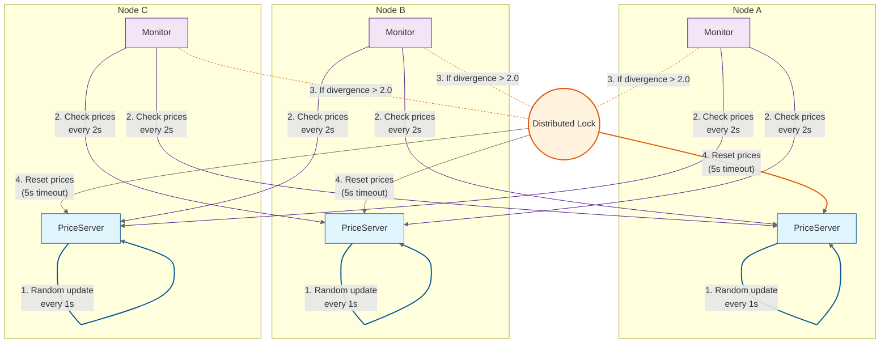

# Distributed Price Synchronization

## Overview
A distributed Elixir application that simulates multi-domain price divergence and autonomous price syncronization. Each node runs a price server that randomly updates its price value. When prices between nodes diverge beyond a defined threshold, they are automatically reset to maintain consistency.

## System Architecture



## Components

**PriceSync.PriceServer**
- Maintains a price value that updates every second
- Updates use Gaussian-distributed random values
- Provides functions to get and reset the price
- Initial price: 10.0
- Update interval: 1 second

**PriceSync.Monitor**
- Monitors price divergence between connected nodes
- Checks prices every 2 seconds
- If price difference exceeds 2.0, affected nodes reset their prices
- Uses a locking mechanism to prevent concurrent resets
- Lock timeout: 5 seconds

**PriceSync.Application**
- OTP Application that supervises both PriceServer and Monitor
- Automatically starts services when nodes launch
- Uses one-for-one supervision strategy

## Environment Setup

To get started, enter the development shell:
```bash
nix develop
```

The test script (`test_price_sync.sh`) automates the process of running and testing the distributed system. The test script performs the following steps, using your machine's hostname to ensure proper node naming and connectivity. Price synchronization is visible in the logged output.

Run it with:


```bash
sh test_price_sync.sh
```


1. Cleans and compiles the project
2. Ensures hex package manager is up to date
3. Starts 3 nodes in the background (node_a, node_b, node_c)
4. Connects the nodes in a mesh topology
5. Waits for the system to stabilize
6. Queries prices from each node to verify operation
7. Allows time for divergence checks
8. Cleanly terminates all nodes